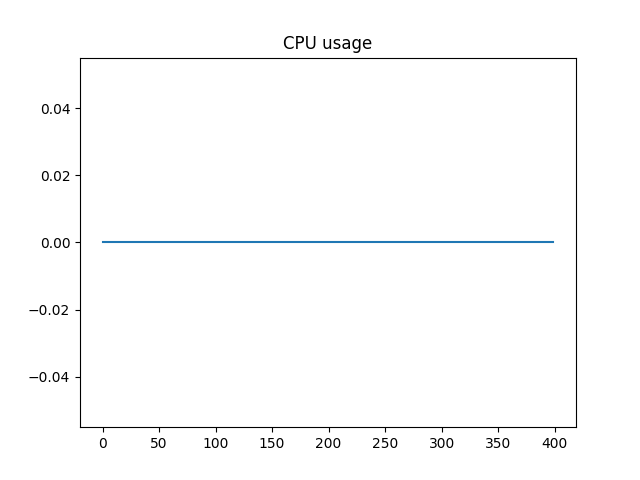
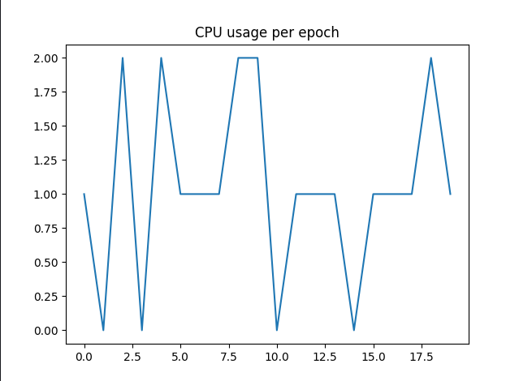
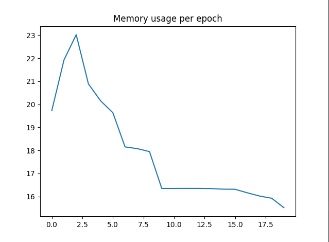
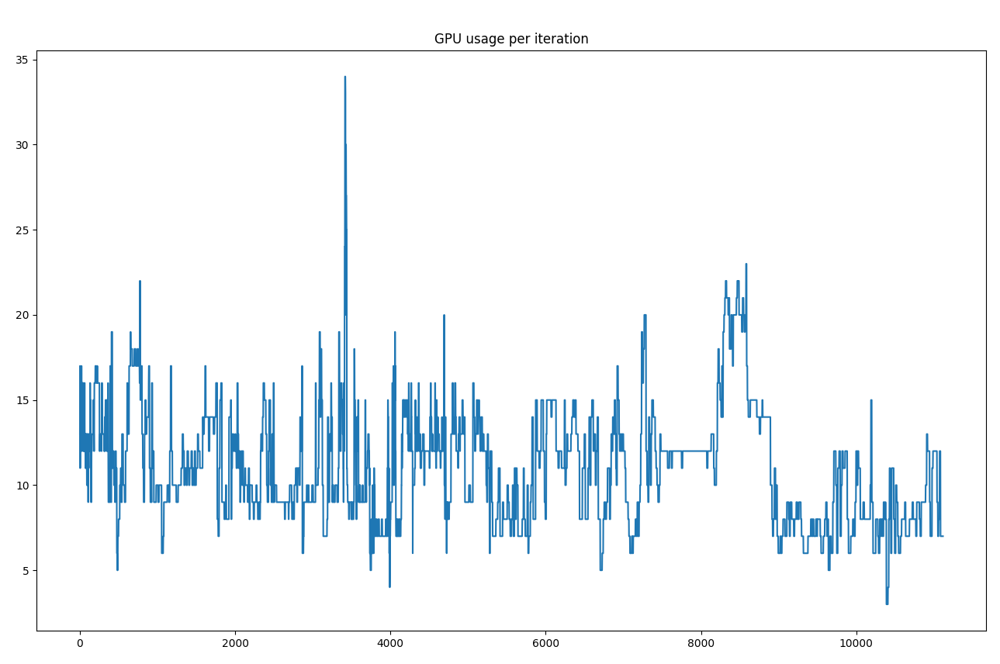
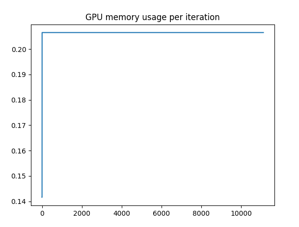
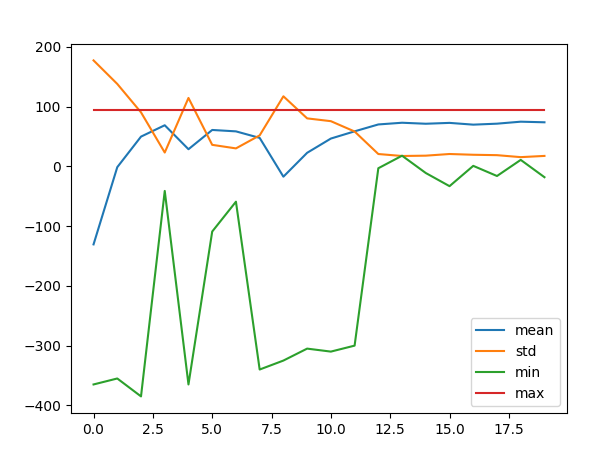

# CS362 - Robótica 2020-02 (CCOMP10-1) - Laboratorio RL-03 - Implemetación y pruebas de VizDoom

## Integrantes

- Rafael Isaac Cano Guitton
- Jhorel Kevin Revilla Calderón

## Repositorio

- <https://github.com/rafaelcanoguitton/VizDoom-Project>

## Experimento Básico Cacodemon

<!-- descripción, ejecución, convergencia y resultados obtenidos -->

Este experimento consiste en tener un agente con comportamiento aleatorio, se presentan 3 acciones, moverse hacia la derecha, hacia la izquierda y disparar.  En este caso el agente por medio de la función `random.choice()`. Tenemos a un enemigo en pantalla, el cual es denominado como ***"Cacodemon"***, se mueve aleatoriamente pero generalmente se mantiene estático.

Este experimento corre hasta llegar a un estado terminal, el cual es cuando el cacodemon muere o se llega al timeout establecido por la función `game.setEpisodeTimeout()`, esta función recibe como parámetro el número de ticks que se desea que el juego corra, en este caso se estableción en 200 ticks.

Nuestro agente ganará 101 puntos por acabar con el enemigo, -5 al fallar un disparo y -1 punto por cada acción que se realice. Con esta configuración tenemos un setup que recompensa al agente por matar al enemigo y penaliza por fallar un disparo y por realizar una acción. El incentivo es hacia sólo realizar acciones que nos lleven a matar al enemigo y a no realizar un disparo fallido.

Cómo nuestro agente es un agente aleatorio realmente no se tiene ningún tipo de aprendizaje pero podemos medir algunos resultados del juego cómo el uso de memoria, cpu y ver los estados para cada tick del juego.

```bash
State #195
Game variables: [39.]
Reward: -1.0
=====================
State #196
Game variables: [39.]
Reward: -1.0
=====================
State #197
Game variables: [39.]
Reward: -1.0
=====================
State #198
Game variables: [39.]
Reward: -1.0
=====================
State #199
Game variables: [39.]
Reward: -1.0
=====================
State #200
Game variables: [39.]
Reward: -1.0
=====================
Episode finished.
```



```bash
CPU usage: 0.0%
CPU usage: 0.0%
CPU usage: 0.0%
CPU usage: 0.0%
CPU usage: 0.0%
CPU usage: 0.0%
CPU usage: 0.0%
CPU usage: 0.0%
CPU usage: 0.0%
```


```bash
Memory usage: 0.4367098233340365%
Memory usage: 0.4237824472234351%
Memory usage: 0.4367098233340365%
Memory usage: 0.4237824472234351%
Memory usage: 0.4367098233340365%
Memory usage: 0.4237824472234351%
Memory usage: 0.4367098233340365%
```
<!-- cacodemon image -->
<!--  -->

## Experimento Básico Medikit Collecting

El segundo experimento es bastante similar al primero, la diferencia crucial está en el hecho de que el episodio no alcanza su estado terminal hastas que se nos acaba la vida, la cual va decreciendo hasta que llega a 0 y sólo aumenta al recolectar un medikit.

El agente tiene un comportamiento aleatorio que sólo puede realizar 2 acciones, la de avanzar y girar hacia la derecha o izquierda, escogida por medio de la función `random.choice()`. Además tenemos


<!-- descripción, ejecución, convergencia y resultados obtenidos -->

## Configuración del Modelo de Deep Q-Learning

- ¿Cómo es el modelo utilizado: MDP, Modelo de premios y modelo Q-Learning?  

Se utiliza un modelo de Deep Q-Learning, donde el proceso de aprendizaje es similar a los juegos implementados del Atari 2600. El MDP se usa para poder escoger la mejor opción de acuerdo a los premios que se vayan ganando o perdiendo. Por ejemplo, en el primer experimento existen n estados, donde cada uno tiene tres acciones: moverse para la derecha, izquierda y disparar. Dependiendo de estas acciones suman o restan puntos, moverse a la izquierda o derecha, disminuye 1 punto, disparar y acertar suma 101 puntos, en caso contrario se resta 5 puntos.

- ¿Qué tipo de política es usada?  

Se emplea una política e-greedy con decaimiento lineal e. Por cada episodio, incrementa el porcentaje de cada acción dependiendo del puntaje obtenido. De esta forma, se puede deducir cuál es la mejor acción en cada estado.

- ¿Cómo se calculan y aproximan los valores Q?
  
- ¿Qué modelo de optimización se usa?
  Emplea un modelo de optimización con gradiente estocástica descendiente.
- ¿Existe estraegia de repetición de experiencias?
  
- ¿Existen objetivos Q fijos?
  
## Experimento cambiando las condiciones del juego y parámetros de configuración del modelo Deep Q-Learning

Las caraceterísticas de Hardware con las cuales se realizó el entrenamiento fueron:

- **CPU:** AMD Ryzen 5 3600 6-Core Processor (12) @ 4.208203 GHz
- **GPU:** NVIDIA GeForce RTX 2060 REV 2.0
- **RAM:** 16GB DDR4 3200MHz
- **OS:** Garuda Linux x86_64
- **Kernel:** 6.0.10-zen2-1-zen

Los parámetros de entrenamiento para el modelo Deep Q-Learning son los siguientes:

- `learning_rate`: 0.00025
- `discount_facto`: 0.99
- `train_epoch`: 20
- `learning_steps_per_epoc`: 2000
- `replay_memory_siz`: 10000
- `batch_size`: 64

El entrenamiento demoró **15.86 minutos**, sin embargo al realizar un segundo entrenamiento con monitoreo demoró **25.12 minutos**.

Se entrenó durante 100 episodios cada epoch, midiendo el desempeño de memoria, uso de CPU, uso de GPU y uso de memoria de GPU. Los resultados se muestran en las siguientes gráficas:
<!-- descripción, ejecución, convergencia y resultados obtenidos -->
<!-- 15.86 sin monitoreo -->
### Uso de CPU:



### Uso de memoria:



### Uso de GPU:



### Uso de memoria de GPU:



### Gráfica de convergencia:


<!-- 25.12 con monitoreo -->

Podemos ver que entrenando un agente utilizando Deep Q-Learning se pueden obtener resultados bastante buenos en un corto periodo de tiempo. Sin embargo podemos ver un bottleneck en cuanto a la ejecución del modelo, ya que se podría utilizar más recursos y obtener una convergencia de forma más rápida.